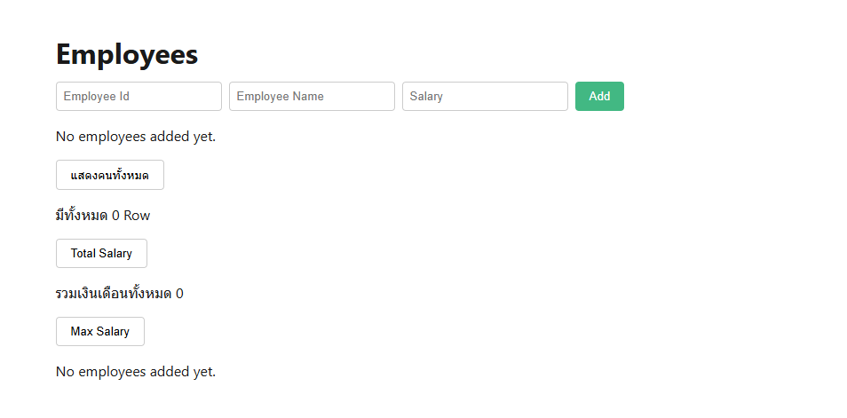
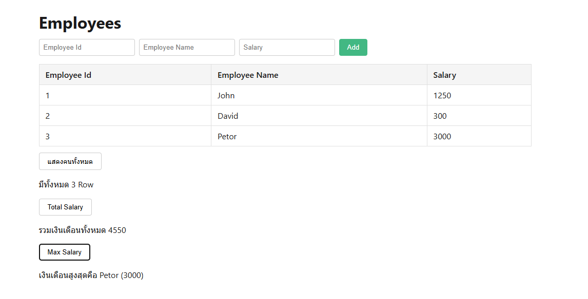

# React + TypeScript + Vite

This template provides a minimal setup to get React working in Vite with HMR.

## โจทย์: Employee Management (React port)

React version ของโจทย์เดียวกันกับ [vue3-interview-test](../vue3-interview-test), ดู [EmployeesView.tsx](src/EmployeesView.tsx)

**Part 1 — Fetch Users**

- ดึงข้อมูล user จาก API `https://jsonplaceholder.typicode.com/users`
- แสดงผลเป็นตาราง (ID, Name, Username, Email, Phone, Website)
- ต้องจัดการ state: Loading และ Error ระหว่างเรียก API

**Part 2 — Employee Form**

- สร้างฟอร์มรับข้อมูล Employee: Employee Id, Employee Name, Salary
- เมื่อกด Add ให้เพิ่มข้อมูลเข้า state (list) โดยไม่ยิง API (เก็บใน local state เท่านั้น)
- แสดงรายการ Employee ทั้งหมดเป็นตาราง

**Part 3 — Summary Actions**

- ปุ่ม "แสดงคนทั้งหมด" → แสดงจำนวนแถว (Row) ทั้งหมดของ Employee
- ปุ่ม "Total Salary" → แสดงผลรวมเงินเดือนของ Employee ทั้งหมด
- ปุ่ม "Max Salary" → แสดงชื่อและเงินเดือนของ Employee ที่มีเงินเดือนสูงสุด
- แต่ละปุ่มกดแล้ว toggle แสดง/ซ่อนผลลัพธ์ได้

## Installation

```bash
npm install
```

## Development

```bash
npm run dev
```

Starts the Vite dev server with hot module replacement.

## Build

```bash
npm run build
```

Type-checks with `tsc` and builds for production.

## Preview

```bash
npm run preview
```

Serves the production build locally to preview it.

## Result





